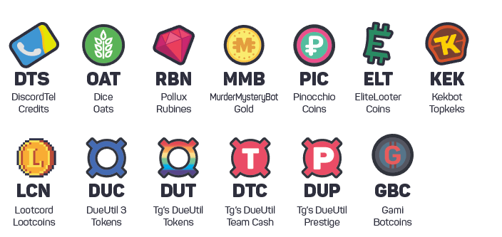

# User's Guide


**If you farm currencies,** specifically, if you operate a server exclusively for earning currencies for Discoin-participating bots, or we've found you intentionally spamming each bot to earn currencies, we'll notify all participating bot owners. **Violators will have their accounts deleted and permanently banned.**



**Pollux is currently not accepting/sending transactions** due to the possibility of a currency reform. Refund will probably take place once Flicky has decided on the plan.


## How can I exchange currency?

### Procedure

1. Create a transaction from the origin bot. See the command list below.
2. Your transaction will be converted at the rates effective at the moment. After a transaction, the rates will [adjust itself](untitled.md).
3. Within 5 minutes, the destination bot will receive your transaction. [Unless...?](users-guide.md#i-did-not-receive-my-payment)

### Commands List

* `<Currency>` means 3-letter currency codes listed [here](https://dash.discoin.zws.im/#/currencies). Exchange rates are listed there too.

| Bot Name | Command | Note |
| :--- | :--- | :--- |
| [Dice\#6134](https://dice.js.org) | `$$convert-oats <Amount> <Currency>` | Rates: `$$discoin-rates` |
| [DiscordTel\#6675](https://discordtel.austinhuang.me) | `>convert <Amount> <Currency>` | Rates: `>convert`, allows 2-digit floats |
| [DueUtil 3.0\#0764](https://dueutil.xyz) | `d!exchange <Amount> <Currency>` | Max 500k DUC per transaction |
| [Elite Looter\#8634](http://sjustein.com/html/elitelooter.html) | `;exchange <Amount> <Currency>` | Info: `;discoin` |
| [Gami\#7891](https://gami.app) | `-transfer <Amount> <Currency>` | Rates: `-transfer rates` |
| [KekBot\#2918](https://discordbots.org/bot/213151748855037953) | `$shop` then react 3 |  |
| [Lootcord\#6294](https://lootcord.com) | `t-convert <Amount> <Currency>` |  |
| [Murder Mystery Bot\#7898](https://top.gg/bot/319204121393496064) | `mm!convert <Currency> <Amount>` | Must create an account to receive Discoin =&gt; `mm!globalgames` |
| [Pinocchio\#5540](https://pinocchiobot.xyz/) | `=exchange <Amount> <Currency>` | Info: `=discoin` |
| [Pollux\#9069](http://pollux.fun) | `+exchange <Amount> <Currency>` | **Discoin modules not in service. See top.** |
| [Theelgirl's DueUtil\#6258](https://dueutil.org) | `!exchange <Amount> <Currency> <DUT/DUTC/DUP>` | Send/Receive limited to 10 transactions per 24h, sending limit exists |

## Can I get/spend Discoins?

No. Discoin only exists during the transaction process and statistics: As a universal _unit_ for calculating currency, it is only used for calculating exchange rates as well as currency reserves. The real world equivalent example would be [XDR](https://en.wikipedia.org/wiki/Special_drawing_rights).

## Can I have a transaction record?

[https://dash.discoin.zws.im/](https://dash.discoin.zws.im/)

## I did not receive my payment!

1. Check [the Transaction Record](https://dash.discoin.zws.im/). If it says the transaction isn't handled, the receiving bot hasn't processed it yet.
2. If it has been more than 5 minutes and the transaction still isn't handled, check if there are any restrictions in place, which are usually announced on this page as well as the support server. Still no avail? Contact the developer\(s\) of the receiving bot.

## Suggested uses of each currency

Here's a table on the earning and spending mechanisms of each bot.

| Bot \(Currency Code\) | How to Earn \(Except voting and daily\) | How to Spend |
| :--- | :--- | :--- |
| Dice \(OAT\) | `$$dice-game` if won | Gambling in `$$dice-game` |
| DiscordTel \(DTS\) | `>lottery` if won | [Renewing your DiscordTel service](https://discordtel.austinhuang.me/en/latest/Payment/), `>message` as well as `>lottery` |
| DueUtil 3.0 \(DUC\) | Quests and `d!blackjack` | `!shop` |
| Elite Looter \(ELT\) | `;open`ing crates gained by chatting, also `;games` | `;shop`ing upgrades as well as playing `;games` to get more crates |
| KekBot \(KEK\) | `$lottery` if won, also `$game` | `$shop`ing profile card decorations as well as`$lottery` |
| Gami \(GBC\) | `-beg`, `-steal`, `-work` | `-gamble` |
| Lootcord \(LCN\) | `t-trivia`, `t-scramble`, `t-gamble`as well as by`t-sell` items/boxes and`t-use` items to loot other users, as well as [depositing in a clan to earn interest](https://github.com/blobfysh/Lootcord/wiki/Clans), see [FAQ](https://lootcord.com/faq) | `t-shop`, `t-bm`, `t-trade` |
| Murder Mystery Bot \(MMB\) | Typing `mm!globalgames` daily | `mm!globalgames` =&gt; Shop |
| Pinocchio \(PIC\) | Chat rewards, as well as coin drops if enabled | `=waifu` \(Buy discounted ones through `=rr`\) as well as `=paidroles` if set |
| Pollux \(RBN\) | `+betflip`, `+blackjack`, `+slots` | `+shop`ing crafting materials and profile decorations |
| Theelgirl's DueUtil \(DUT\) | Quests, `!joinjob`  | `!shop` for upgrades |
| ~ \(DTC\) | Quests | `!teamshop`  |
| ~ \(DUP\) | `!prestige` | `!prestigeshop` |

## Credits \(aka. "How can I support Discoin?"\)

Discoin is a cooperative project, combining efforts of many developers from diverse backgrounds across the globe.

* Discoin v3 is coded and hosted by [Jonah Snider](https://jonah.pw) \(Dice\). Subdomain provided by [Zero Width Shortener](https://zws.im). Consider supporting him on [Patreon](https://www.patreon.com/pizzafox) or [Open Collective](https://opencollective.com/zws) to help paying for server cost!
* The concept, math, and non-technical documentation of Discoin is developed by [Austin Huang](https://austinhuang.me) \(DiscordTel\).
* [Ari Gami](https://github.com/dr-ari-gami) \(Gami\), [DeveloperAnonymous](https://github.com/DeveloperAnonymous) \(DueUtil 3.0\), [Godson](https://github.com/Godson777) \(Kekbot\) and [Theelgirl](https://github.com/Theelgirl) \('s DueUtil\) contributed to the [libraries](developers/guide.md#libraries).
* Currency graphics \(except Discoin logo\) created by [Lucas Flicky](http://lucasflicky.com/) \(Pollux\). Discoin logo created by ImRock \([Welcomer](https://welcomer.gg)\).
* [Discoin is open source.](https://github.com/discoin/api-v3) If you cannot contribute financially, consider contributing your time reviewing the code!
* And of course, you can easily support Discoin by spreading the word to the world! Convince the developers of your favourite bot\(s\) to implement Discoin by showing this guide to them.

